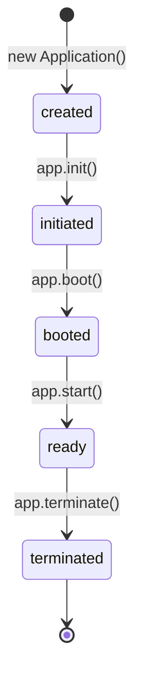

The AdonisJS application follows a well-defined lifecycle with distinct states and hooks. Understanding this lifecycle is crucial for properly initializing services, managing resources, and ensuring graceful shutdowns.

## Application States

An AdonisJS application progresses through the following states:



<Steps>
  <Step title="created">
    The application instance has been created but not yet initialized.
    
    ```typescript
    const app = new Application(new URL('../', import.meta.url))
    console.log(app.getState()) // 'created'
    ```
  </Step>
  
  <Step title="initiated">
    Configuration has been loaded and service providers have been registered.
    
    ```typescript
    await app.init()
    console.log(app.getState()) // 'initiated'
    ```
  </Step>
  
  <Step title="booted">
    All service providers have been booted and their services are ready.
    
    ```typescript
    await app.boot()
    console.log(app.getState()) // 'booted'
    ```
  </Step>
  
  <Step title="ready">
    The application has started and is ready to serve requests or handle commands.
    
    ```typescript
    await app.start(() => {})
    console.log(app.getState()) // 'ready'
    ```
  </Step>
  
  <Step title="terminated">
    The application has been gracefully shut down.
    
    ```typescript
    await app.terminate()
    console.log(app.getState()) // 'terminated'
    ```
  </Step>
</Steps>

## Lifecycle Methods

### init()

Initializes the application by loading configuration and registering service providers:

```typescript
await app.init(): Promise<void>
```

During initialization:
1. Configuration files are loaded from the `config/` directory
2. The `.adonisrc.ts` file is read to discover service providers
3. All service providers' `register()` methods are called
4. Services are bound to the IoC container

```typescript
import { Ignitor } from '@adonisjs/core'

const ignitor = new Ignitor(new URL('../', import.meta.url))
const app = ignitor.createApp('web')

await app.init()
// App state is now 'initiated'
// Container has all service bindings
```

### boot()

Boots all registered service providers:

```typescript
await app.boot(): Promise<void>
```

During boot:
1. All service providers' `boot()` methods are called in order
2. Services can resolve dependencies from the container
3. Cross-service initialization occurs

```typescript
await app.init()
await app.boot()
// App state is now 'booted'
// All services are initialized and ready
```

<Note>
  The `boot()` method is idempotent. Calling it multiple times has no effect after the first call.
</Note>

### start()

Starts the application and calls the ready hooks:

```typescript
await app.start(callback: () => void | Promise<void>): Promise<void>
```

During start:
1. The provided callback is executed
2. All service providers' `ready()` methods are called
3. Application state transitions to `'ready'`

```typescript
await app.init()
await app.boot()
await app.start(async () => {
  // Application-specific startup logic
  const server = await app.container.make('server')
  await server.boot()
})
// App state is now 'ready'
```

### terminate()

Gracefully shuts down the application:

```typescript
await app.terminate(): Promise<void>
```

During termination:
1. Terminating hooks are called (registered via `app.terminating()`)
2. All service providers' `shutdown()` methods are called
3. Resources are cleaned up and connections are closed
4. Application state transitions to `'terminated'`

```typescript
process.on('SIGTERM', async () => {
  await app.terminate()
  process.exit(0)
})
```

## Lifecycle Hooks

You can register hooks to run at specific points in the application lifecycle:

### booting()

Register a callback that runs before the application boots:

```typescript
app.booting(async () => {
  console.log('Application is about to boot')
})
```

### booted()

Register a callback that runs after the application has booted:

```typescript
app.booted(async () => {
  console.log('Application has booted')
  // Services are available in the container
})
```

### ready()

Register a callback that runs when the application is ready:

```typescript
app.ready(async () => {
  console.log('Application is ready')
  // Application is fully started
})
```

### terminating()

Register a callback that runs when the application is terminating:

```typescript
app.terminating(async () => {
  console.log('Application is terminating')
  // Clean up resources, close connections
})
```

## Full Lifecycle Example

Here's a complete example showing the application lifecycle in an HTTP server:

```typescript title="bin/server.ts"
import { Ignitor } from '@adonisjs/core'

const ignitor = new Ignitor(new URL('../', import.meta.url))

// Tap into app creation
ignitor.tap((app) => {
  console.log('1. App created:', app.getState()) // 'created'
  
  // Register lifecycle hooks
  app.booting(() => {
    console.log('2. App is booting')
  })
  
  app.booted(() => {
    console.log('4. App has booted:', app.getState()) // 'booted'
  })
  
  app.ready(() => {
    console.log('6. App is ready:', app.getState()) // 'ready'
  })
  
  app.terminating(() => {
    console.log('7. App is terminating')
  })
})

await ignitor.httpServer().start()
// Output:
// 1. App created: created
// 2. App is booting
// 3. Providers registering services (init)
// 4. App has booted: booted
// 5. Server starting
// 6. App is ready: ready
```

## Service Provider Lifecycle

Service providers have their own lifecycle methods that align with the application lifecycle:

```typescript
export default class MyServiceProvider {
  constructor(protected app: ApplicationService) {}

  /**
   * Called during app.init()
   * Register services with the container
   */
  register() {
    this.app.container.singleton('myService', () => {
      return new MyService()
    })
  }

  /**
   * Called during app.boot()
   * Boot services and resolve dependencies
   */
  async boot() {
    const myService = await this.app.container.make('myService')
    await myService.initialize()
  }

  /**
   * Called during app.start()
   * Finalize setup when app is ready
   */
  async ready() {
    const myService = await this.app.container.make('myService')
    myService.startBackgroundTasks()
  }

  /**
   * Called during app.terminate()
   * Clean up resources
   */
  async shutdown() {
    const myService = await this.app.container.make('myService')
    await myService.cleanup()
  }
}
```

<Note>
  All lifecycle methods in service providers are optional. Only implement the ones you need.
</Note>

## HTTP Server Lifecycle

The HTTP server has additional lifecycle events specific to web applications:

```typescript
import { Ignitor } from '@adonisjs/core'

const ignitor = new Ignitor(new URL('../', import.meta.url))

ignitor.tap(async (app) => {
  const emitter = await app.container.make('emitter')
  
  emitter.on('http:server_ready', ({ host, port, duration }) => {
    console.log(`Server started on ${host}:${port}`)
    console.log(`Startup time: ${duration[0]}s ${duration[1] / 1000000}ms`)
  })
})

await ignitor.httpServer().start()
```

## Ace Command Lifecycle

Ace commands have a conditional lifecycle based on whether they need the full application:

```typescript
import { BaseCommand } from '@adonisjs/core/ace'
import type { CommandOptions } from '@adonisjs/core/types/ace'

export default class MyCommand extends BaseCommand {
  static commandName = 'my:command'
  
  // This command needs the full app booted
  static options: CommandOptions = {
    startApp: true
  }

  async run() {
    // App is booted and ready
    const logger = await this.app.container.make('logger')
    logger.info('Command running')
  }
}
```

<Accordion title="Commands without startApp">
Commands with `startApp: false` (or undefined) run faster because they skip the boot phase:

```typescript
export default class QuickCommand extends BaseCommand {
  static commandName = 'quick:command'
  
  // App won't be booted
  static options: CommandOptions = {
    startApp: false
  }

  async run() {
    // App is only initiated, not booted
    // Container bindings may not be available
    console.log('Quick command running')
  }
}
```
</Accordion>

## Environment-Specific Behavior

The application lifecycle can vary slightly based on the environment:

<Tabs>
  <Tab title="Web">
    Full lifecycle with HTTP server:
    
    1. `init()` - Load config and register providers
    2. `boot()` - Boot all providers
    3. `start()` - Start HTTP server
    4. Server listens and handles requests
    5. `terminate()` - Close server and clean up
  </Tab>
  
  <Tab title="Console">
    Conditional lifecycle based on command:
    
    1. `init()` - Load config and register providers
    2. `boot()` - Only if command has `startApp: true`
    3. `start()` - Only if command has `startApp: true`
    4. Execute command
    5. `terminate()` - Unless command has `staysAlive: true`
  </Tab>
  
  <Tab title="Test">
    Full lifecycle for test suite:
    
    1. `init()` - Load config and register providers
    2. `boot()` - Boot all providers
    3. `start()` - Prepare for tests
    4. Run test suite
    5. `terminate()` - Clean up after tests
  </Tab>
  
  <Tab title="REPL">
    Interactive lifecycle:
    
    1. `init()` - Load config and register providers
    2. `boot()` - Boot all providers
    3. `start()` - Start REPL session
    4. User interacts with REPL
    5. `terminate()` - User exits REPL
  </Tab>
</Tabs>

## Graceful Shutdown

AdonisJS handles graceful shutdown automatically, but you can customize the behavior:

```typescript title="bin/server.ts"
import { Ignitor } from '@adonisjs/core'

const ignitor = new Ignitor(new URL('../', import.meta.url))

ignitor.tap((app) => {
  app.terminating(async () => {
    // Close database connections
    const db = await app.container.make('lucid.db')
    await db.manager.closeAll()
    
    // Wait for pending jobs
    const queue = await app.container.make('queue')
    await queue.drain()
    
    console.log('Cleanup complete')
  })
})

await ignitor.httpServer().start()

// Handle signals
process.on('SIGTERM', () => ignitor.terminate())
process.on('SIGINT', () => ignitor.terminate())
```

## Next Steps

<CardGroup cols={2}>
  <Card title="Service Providers" icon="plug" href="./service-providers">
    Learn how to create service providers with lifecycle hooks
  </Card>
  <Card title="Container" icon="box" href="./container">
    Understand the IoC container for dependency injection
  </Card>
</CardGroup>
