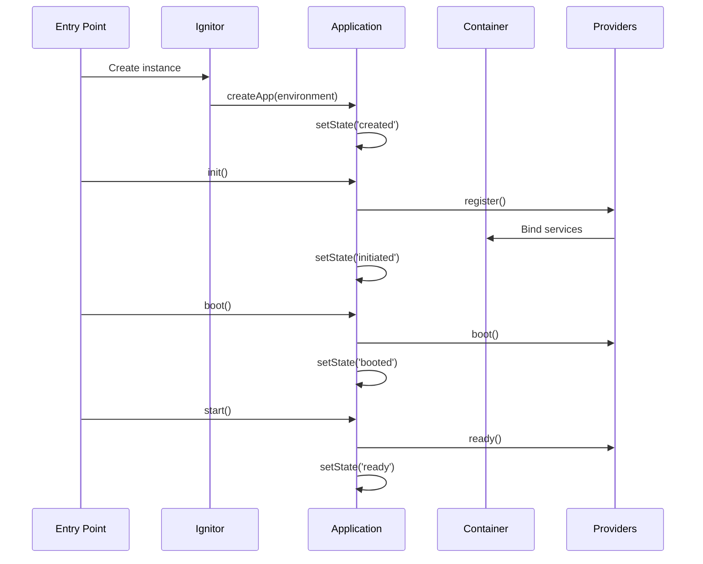

AdonisJS follows a modular architecture built around a powerful IoC (Inversion of Control) container and a well-defined application lifecycle. Understanding these core concepts will help you build robust and maintainable applications.

## Core Components

The AdonisJS architecture consists of several key components that work together:

<CardGroup cols={2}>
  <Card title="Ignitor" icon="rocket" href="./ignitor">
    The entry point for bootstrapping your application in different environments
  </Card>
  <Card title="Application" icon="cube" href="./application-lifecycle">
    Manages the application lifecycle from initialization to termination
  </Card>
  <Card title="Container" icon="box" href="./container">
    IoC container for dependency injection and service management
  </Card>
  <Card title="Service Providers" icon="plug" href="./service-providers">
    Modular units for registering and bootstrapping services
  </Card>
</CardGroup>

## Architecture Flow

The following diagram illustrates how these components interact during application startup:



## Application Environments

AdonisJS applications can run in different environments, each optimized for specific use cases:

<AccordionGroup>
  <Accordion title="Web Environment">
    Used for HTTP server processes. This is the most common environment for production applications.
    
    ```typescript
    const ignitor = new Ignitor(new URL('../', import.meta.url))
    await ignitor.httpServer().start()
    ```
  </Accordion>
  
  <Accordion title="Console Environment">
    Used for CLI commands and Ace operations. Provides access to the application without starting the HTTP server.
    
    ```typescript
    const ignitor = new Ignitor(new URL('../', import.meta.url))
    await ignitor.ace().handle(process.argv.slice(2))
    ```
  </Accordion>
  
  <Accordion title="Test Environment">
    Optimized for running tests with utilities for creating test contexts and factories.
    
    ```typescript
    const ignitor = new Ignitor(new URL('../', import.meta.url))
    await ignitor.testRunner().run(() => {})
    ```
  </Accordion>
  
  <Accordion title="REPL Environment">
    Interactive shell environment for exploring your application at runtime.
    
    ```bash
    node ace repl
    ```
  </Accordion>
</AccordionGroup>

## Dependency Injection

AdonisJS uses constructor-based dependency injection powered by the IoC container:

```typescript
import { inject } from '@adonisjs/core'
import type { HttpContext } from '@adonisjs/core/http'
import UserService from '#services/user_service'

@inject()
export default class UsersController {
  constructor(protected userService: UserService) {}
  
  async index({ response }: HttpContext) {
    const users = await this.userService.findAll()
    return response.json(users)
  }
}
```

<Note>
  The `@inject()` decorator enables automatic dependency resolution from the container. The container will instantiate `UserService` and inject it into the controller.
</Note>

## Service Registration

Services are registered with the container through service providers. There are three types of bindings:

<Steps>
  <Step title="Singleton Bindings">
    Created once and shared across the application lifetime:
    
    ```typescript
    this.app.container.singleton('logger', async () => {
      return new LoggerManager(config)
    })
    ```
  </Step>
  
  <Step title="Transient Bindings">
    Created fresh on each resolution:
    
    ```typescript
    this.app.container.bind('mailer', async () => {
      return new Mailer(config)
    })
    ```
  </Step>
  
  <Step title="Value Bindings">
    Direct value registration:
    
    ```typescript
    this.app.container.bindValue('config', configInstance)
    ```
  </Step>
</Steps>

## Configuration System

AdonisJS uses a type-safe configuration system with support for lazy loading:

```typescript
import { defineConfig } from '@adonisjs/core/app'

export default defineConfig({
  appKey: env.get('APP_KEY'),
  http: {
    cookie: {},
    trustProxy: false
  }
})
```

Some configurations support config providers that resolve during the boot phase:

```typescript
import { defineConfig } from '@adonisjs/lucid'

export default defineConfig({
  type: 'provider',
  resolver: async (app) => {
    return {
      connection: app.env.get('DB_CONNECTION', 'sqlite'),
      connections: {
        // Database connections
      }
    }
  }
})
```

## Next Steps

<CardGroup cols={2}>
  <Card title="Ignitor" icon="rocket" href="./ignitor">
    Learn how the Ignitor bootstraps your application
  </Card>
  <Card title="Application Lifecycle" icon="refresh" href="./application-lifecycle">
    Understand the application states and lifecycle hooks
  </Card>
  <Card title="Container" icon="box" href="./container">
    Deep dive into the IoC container and dependency injection
  </Card>
  <Card title="Service Providers" icon="plug" href="./service-providers">
    Create custom service providers for your modules
  </Card>
</CardGroup>
