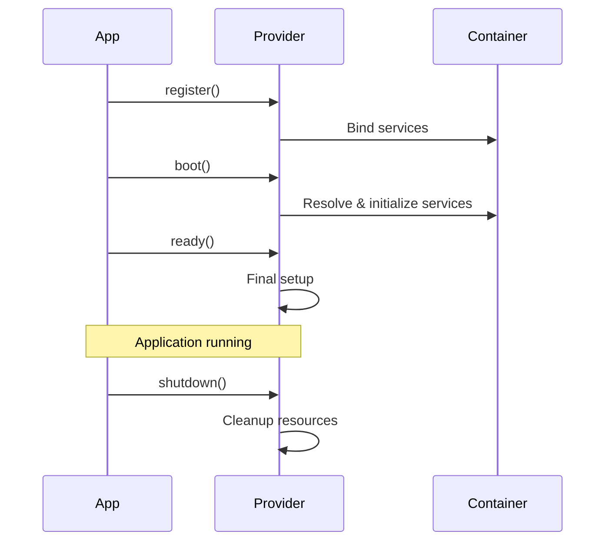

Service providers are the fundamental building blocks for bootstrapping AdonisJS applications. They provide a standardized way to register services with the IoC container and manage their lifecycle.

## What are Service Providers?

Service providers are classes that:
- Register services and bindings with the IoC container
- Boot and initialize services after registration
- Perform cleanup during application shutdown
- Enable modular application architecture

<Info>
  Every service in AdonisJS, from the logger to the HTTP server, is registered through a service provider.
</Info>

## Provider Lifecycle

Service providers have lifecycle methods that execute at specific points during application startup:



## Creating a Service Provider

Generate a new service provider using the Ace command:

```bash
node ace make:provider DatabaseProvider
```

This creates a provider file in the `providers/` directory:

```typescript title="providers/database_provider.ts"
import type { ApplicationService } from '@adonisjs/core/types'

export default class DatabaseProvider {
  constructor(protected app: ApplicationService) {}

  /**
   * Register bindings to the container
   */
  register() {
    this.app.container.singleton('database', () => {
      return new Database(this.app.config.get('database'))
    })
  }

  /**
   * The container bindings have booted
   */
  async boot() {
    const db = await this.app.container.make('database')
    await db.connect()
  }

  /**
   * The application has been booted
   */
  async ready() {
    // Finalize setup
  }

  /**
   * The process has been started
   */
  async start() {
    // Start background tasks
  }

  /**
   * Cleanup when the app is shutting down
   */
  async shutdown() {
    const db = await this.app.container.make('database')
    await db.disconnect()
  }
}
```

## Lifecycle Methods

<Accordion title="register()">
  Called during `app.init()` to register services with the container.
  
  ```typescript
  register() {
    // Singleton binding - created once and reused
    this.app.container.singleton('cache', () => {
      return new CacheManager(config)
    })
    
    // Transient binding - created on each resolution
    this.app.container.bind('mailer', () => {
      return new Mailer(config)
    })
    
    // Value binding - direct value
    this.app.container.bindValue('apiUrl', 'https://api.example.com')
  }
  ```
  
  <Note>
    The `register()` method should only create bindings. Don't resolve services here as other providers may not have registered their bindings yet.
  </Note>
</Accordion>

<Accordion title="boot()">
  Called during `app.boot()` after all providers have registered their bindings.
  
  ```typescript
  async boot() {
    // Safe to resolve services from other providers
    const router = await this.app.container.make('router')
    const emitter = await this.app.container.make('emitter')
    
    // Set up integrations between services
    router.use((ctx, next) => {
      emitter.emit('http:request', ctx)
      return next()
    })
  }
  ```
  
  <Note>
    This is where cross-service initialization happens. All bindings are available at this stage.
  </Note>
</Accordion>

<Accordion title="ready()">
  Called during `app.start()` when the application is ready to serve requests.
  
  ```typescript
  async ready() {
    // Generate route types in development
    if (!this.app.inProduction) {
      const router = await this.app.container.make('router')
      await this.generateRouteTypes(router)
    }
  }
  ```
</Accordion>

<Accordion title="start()">
  Called when the application process starts (after ready hooks).
  
  ```typescript
  async start() {
    const queue = await this.app.container.make('queue')
    await queue.startWorkers()
  }
  ```
</Accordion>

<Accordion title="shutdown()">
  Called during `app.terminate()` to clean up resources.
  
  ```typescript
  async shutdown() {
    const queue = await this.app.container.make('queue')
    await queue.stopWorkers()
    
    const db = await this.app.container.make('database')
    await db.closeConnections()
  }
  ```
  
  <Warning>
    Always clean up resources in the shutdown method to prevent memory leaks and ensure graceful termination.
  </Warning>
</Accordion>

## Real-World Example: App Service Provider

Let's examine the core AppServiceProvider that ships with AdonisJS:

```typescript title="providers/app_provider.ts"
import { Config } from '../modules/config.ts'
import { Logger } from '../modules/logger.ts'
import { Application } from '../modules/app.ts'
import { Emitter } from '../modules/events.ts'
import type { ApplicationService } from '../src/types.ts'

export default class AppServiceProvider {
  constructor(protected app: ApplicationService) {}

  protected registerApp() {
    this.app.container.singleton(Application, () => this.app)
    this.app.container.alias('app', Application)
  }

  protected registerLogger() {
    this.app.container.singleton(Logger, async (resolver) => {
      const loggerManager = await resolver.make('logger')
      return loggerManager.use()
    })
  }

  protected registerLoggerManager() {
    this.app.container.singleton('logger', async () => {
      const { LoggerManager } = await import('../modules/logger.js')
      const config = this.app.config.get<any>('logger')
      return new LoggerManager(config)
    })
  }

  protected registerConfig() {
    this.app.container.singleton(Config, () => this.app.config)
    this.app.container.alias('config', Config)
  }

  protected registerEmitter() {
    this.app.container.singleton(Emitter, async () => {
      return new Emitter(this.app)
    })
    this.app.container.alias('emitter', Emitter)
  }

  register() {
    this.registerApp()
    this.registerLoggerManager()
    this.registerLogger()
    this.registerConfig()
    this.registerEmitter()
  }

  async boot() {
    const emitter = await this.app.container.make('emitter')
    // Configure emitter for base events
  }

  async ready() {
    if (!this.app.inProduction) {
      const router = await this.app.container.make('router')
      if (router.commited) {
        await this.emitRoutes(router)
      }
    }
  }
}
```

Key patterns in this provider:
1. Organized into focused `register*()` methods
2. Uses both class bindings and aliases
3. Lazy loads heavy dependencies with dynamic imports
4. Separates concerns across lifecycle methods

## Real-World Example: Hash Service Provider

Here's how the HashServiceProvider registers password hashing functionality:

```typescript title="providers/hash_provider.ts"
import { Hash } from '../modules/hash/main.ts'
import { configProvider } from '../src/config_provider.ts'
import type { ApplicationService } from '../src/types.ts'

export default class HashServiceProvider {
  constructor(protected app: ApplicationService) {}

  protected registerHash() {
    this.app.container.singleton(Hash, async (resolver) => {
      const hashManager = await resolver.make('hash')
      return hashManager.use()
    })
  }

  protected registerHashManager() {
    this.app.container.singleton('hash', async () => {
      const hashConfigProvider = this.app.config.get('hash')
      
      // Resolve config from the provider
      const config = await configProvider.resolve(this.app, hashConfigProvider)
      if (!config) {
        throw new RuntimeException(
          'Invalid "config/hash.ts" file. Make sure you are using the "defineConfig" method'
        )
      }
      
      const { HashManager } = await import('../modules/hash/main.js')
      return new HashManager(config)
    })
  }

  register() {
    this.registerHashManager()
    this.registerHash()
  }
}
```

This provider demonstrates:
- Manager pattern with default driver access
- Config provider resolution for lazy configuration
- Proper error handling for invalid config

## Registering Providers

Register your providers in the `adonisrc.ts` file:

```typescript title="adonisrc.ts"
import { defineConfig } from '@adonisjs/core/app'

export default defineConfig({
  providers: [
    () => import('@adonisjs/core/providers/app_provider'),
    () => import('@adonisjs/core/providers/hash_provider'),
    () => import('./providers/database_provider.js'),
    () => import('./providers/queue_provider.js'),
  ]
})
```

<Note>
  Providers are registered as dynamic imports to enable code splitting and lazy loading.
</Note>

## Environment-Specific Providers

Register providers conditionally based on the environment:

```typescript title="adonisrc.ts"
import { defineConfig } from '@adonisjs/core/app'

export default defineConfig({
  providers: [
    () => import('@adonisjs/core/providers/app_provider'),
    () => import('./providers/database_provider.js'),
  ],
  metaFiles: [
    {
      pattern: 'providers/*_provider.ts',
      reloadServer: false
    }
  ],
  // Environment-specific providers
  commands: [
    () => import('./providers/repl_provider.js'),
  ],
  tests: [
    () => import('./providers/test_provider.js'),
  ]
})
```

## Container Bindings

Service providers can create different types of container bindings:

### Singleton Bindings

Created once and reused throughout the application:

```typescript
register() {
  this.app.container.singleton('database', () => {
    return new Database(config)
  })
}
```

### Transient Bindings

Created fresh on each resolution:

```typescript
register() {
  this.app.container.bind('mailer', () => {
    return new Mailer(config)
  })
}
```

### Class Bindings

Bind using class constructors:

```typescript
register() {
  this.app.container.singleton(UserService, () => {
    return new UserService(dependencies)
  })
}
```

### Aliasing

Create aliases for easier access:

```typescript
register() {
  this.app.container.singleton(Logger, () => new Logger())
  this.app.container.alias('logger', Logger)
  
  // Now accessible via both:
  // await app.container.make(Logger)
  // await app.container.make('logger')
}
```

## Accessing the Application

The application instance is injected into the provider constructor:

```typescript
export default class MyProvider {
  constructor(protected app: ApplicationService) {}

  register() {
    // Access configuration
    const config = this.app.config.get('myService')
    
    // Check environment
    if (this.app.inProduction) {
      // Production-specific setup
    }
    
    // Get paths
    const tmpPath = this.app.tmpPath('uploads')
    
    // Access container
    this.app.container.singleton('myService', () => {
      return new MyService(config)
    })
  }
}
```

## Common Patterns

### Manager Pattern

Many services use a manager pattern with multiple drivers:

```typescript
register() {
  // Register the manager
  this.app.container.singleton('cache', () => {
    return new CacheManager({
      default: 'redis',
      stores: {
        redis: { driver: 'redis', /* config */ },
        memory: { driver: 'memory', /* config */ }
      }
    })
  })
  
  // Register default driver access
  this.app.container.singleton(Cache, async (resolver) => {
    const manager = await resolver.make('cache')
    return manager.use() // Returns default driver
  })
}
```

### Lazy Loading

Defer expensive imports until needed:

```typescript
register() {
  this.app.container.singleton('search', async () => {
    // Only load when first accessed
    const { SearchEngine } = await import('./search/engine.js')
    return new SearchEngine(config)
  })
}
```

### Config Providers

Resolve configuration during boot phase:

```typescript
register() {
  this.app.container.singleton('database', async () => {
    const dbConfigProvider = this.app.config.get('database')
    const config = await configProvider.resolve(this.app, dbConfigProvider)
    
    const { DatabaseManager } = await import('./database/manager.js')
    return new DatabaseManager(config)
  })
}
```

## Testing with Providers

Service providers make testing easier by allowing you to swap implementations:

```typescript title="tests/example.spec.ts"
import { test } from '@japa/runner'

test('use mock service', async ({ assert }) => {
  const ignitor = new IgnitorFactory()
    .merge({
      rcFileContents: {
        providers: [
          () => import('../providers/app_provider.js'),
          // Add test-specific provider
          () => import('../tests/providers/mock_mail_provider.js'),
        ]
      }
    })
    .create(BASE_URL)
    
  const app = ignitor.createApp('test')
  await app.init()
  await app.boot()
  
  const mailer = await app.container.make('mailer')
  assert.instanceOf(mailer, MockMailer)
})
```

## Next Steps

<CardGroup cols={2}>
  <Card title="Container" icon="box" href="./container">
    Deep dive into the IoC container and dependency injection
  </Card>
  <Card title="Ignitor" icon="rocket" href="./ignitor">
    Learn how the Ignitor bootstraps providers
  </Card>
</CardGroup>
